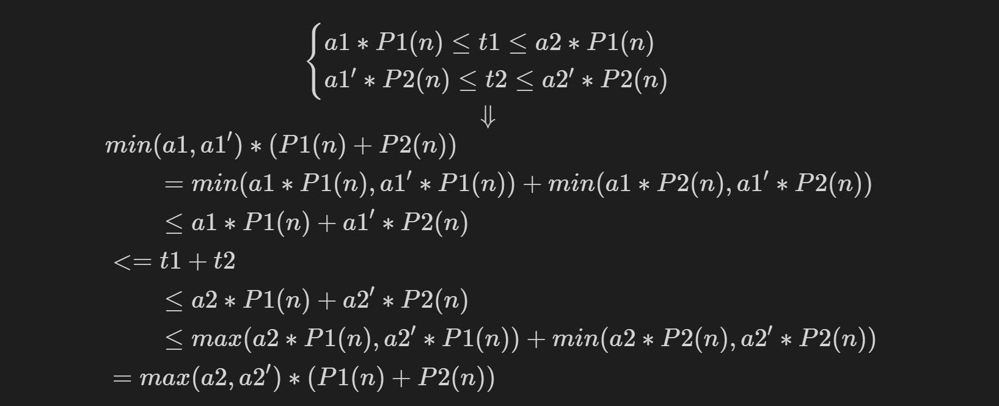
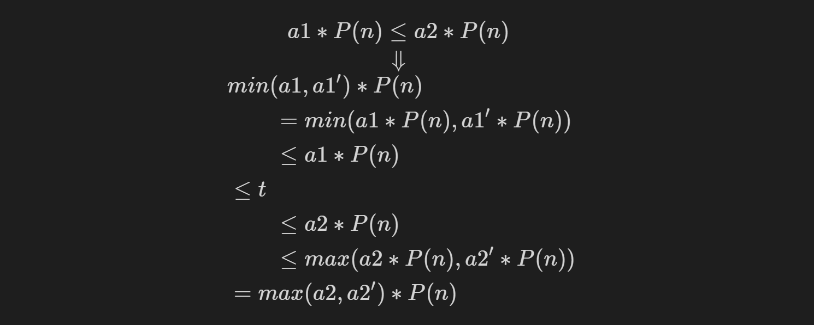
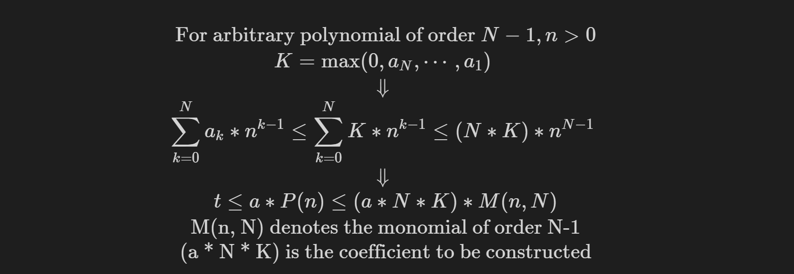

# PL-Project: Asymptotic Complexity
The project for programming language course. The main goal of the project is to introduce the concept of asymptotic complexity into the proof system defined by Hoare Logic and based on Denotational Semantics.

___First three sections are almost the same as the ones in proposal and mid-term check, you may skip to the last section to see proof outlines.___

_We failed to update lines for each definition and theorems and to include some new definitions and theorems here, due to limited time. We are very sorry for that._

## __Project Goals__
- [x] Define __polynomial__ to support operations and simplifications in asymptotic bounds.
- [x] Define various __asymptotic bounds__ and __asymptotic notations__ in coq.
- [x] Update __denotational semantics__ to include time step (done in class) and to fit our project.
- Adapt Hoare logic to include __the proof system for asymptotic complexity__.
  - [x] Hoare Skip
  - [x] Hoare Assignment
  - [x] Hoare Sequence BigTheta
  - [ ] Hoare Sequence BigO
  - [ ] Hoare Sequence BigOmega
  - [x] Hoare If Same
  - [x] Hoare Loosen (New Rule)
  - [x] Hoare While Linear
  - [ ] Hoare While General
- Prove __the soundness of Hoare logic__, both the basic Hoare logic and the proof system for asymptotic complexity.
  - [x] Hoare Skip
  - [x] Hoare Assignment
  - [x] Hoare Sequence BigTheta
  - [ ] Hoare Sequence BigO
  - [ ] Hoare Sequence BigOmega
  - [x] Hoare If Same
  - [x] Hoare Loosen (New Rule)
  - [x] Hoare While Linear
  - [ ] Hoare While General
- Prove __the correctness and asymptotic complexity for some simple algorithms__ encountered in class using what we will build.
  - [x] Simple While
  - [x] Slow Addition
  - [ ] Min While

## __Constraints__
There are several constraints that might limit what we can do or simplify what we want to do.
- We do not consider programs with __control statements__, i.e. _break_ and _continue_. Moreover, we do not wish to alter the potential path of program execution in similar ways, which makes the execution time almost independent with the __distribution of input data__. This cause us unable to verify the asymptotic complexity of algorithms like Quick Sort, but will simplify our definition of what is Asymptotic Complexity.
- We will use the __the toy language developed in class__ or the adapted version of it, which only contains very fundamental operations and statements. This will limit the scope of programs and algorithms we can take into consideration.

---

## __Project Overview__
Our project has following files:
- __Imp8.v__: basic library of the toy language, from the course.
- __PolyAB.v__: defines polynomial and its operation, and asymptotic bounds defined on polynomials, and mathematic lemmas used later.
- __Denotation.v__: the denational semantics with steps, mainly from the course but modified.
- __HoareLogic.v__: the hoare logic with asymptotic bound, should contain rules and provable definition
- __Soundness.v__: the proof for the soundness of hoare logic
- __Demos.v__: examples of programs proved (or to be proved) using our hoare logic
- __AsymptoticBound.v__: pure mathematic asymptotic bound definition attempts (abandonded)

## __Compilation Order__
Please compile the project in the following order:
- Imp8.v -> PolyAB.v -> Denotation.v -> HoareLogic.v -> Soundness.v -> Demos.v

## __Definitions__
### __Polynomial__ (in PolyAB.v)
- __poly__ (at ___line 11___)
  - A list of Z, each represents a coefficient at certain term.
  - The power increases as the index goes up.
- __poly_eval__ (at ___line 21___)
  - A recursive function that evaluates a poly into functions that maps Z to Z based on the semantics.
- TPower: (at line 31)
  - An auxiliary recursive function that implements the power operation for logical_var.
- __poly_eval_lv__ (at ___line 37___)
  - A recursive function that evaluates a poly into functions that maps logical_var to term based on the semantics. 
  - Might be used in defining recursive equations in Hoare While General Rule.
- __poly_add__ (p1 +++ p2) (at ___line 48___)
  - A recursive function that adds two polys into one poly. 
- __trim_0__ (at ___line 56___)
  - A recursive function that removes 0s at tail, i.e. in the highest order terms. 
  - Used in determining the valid highest order term.
- __poly_scalar_mult__ (k ** p) (at ___line 65___)
  - A recursive function that multiplies a Z scalar to a poly to get a new poly. 
- __poly_mult__ (p1 *** p2) (at ___line 71___)
  - A recursive function that multiplies two polys to get a new poly. 
### __Polynomial Asymptotic Bound__ (in PolyAB.v)
- __AsymptoticBound__ (at ___line 321___)
  - An inductive type that specifies different asymptotic bounds. 
- __ab_eval__ (at ___line 326___)
  - A function that takes Lassn, AsymptoticBound, and other Z parameters to formalize the asymptotic property defined by the asymptotic bound in Porp. 
- __loosen__ (T1 =< T2) (at ___line 338___)
  - An inductive relation that specifies the loosening relationship between two bounds. 
  - The first AB (T1) can be relaxed to the second AB (T2). 
  - We did not prove the correctness in this file, but in the soundness proof of the Hoare Logic.
### __Command Denotation With Steps__ (in Denotation.v)
- skip_sem (at ___line 8___)
  - Almost the same as the one in class, but we specify the time step for Skip to be 1. 
- asgn_sem (at ___line 14___)
  - Almost the same as the one in class, but we move the time step property outside. 
- seq_sem (at line 20)
  - The same as the one in class. 
- if_sem (at line 27)
  - Almost the same as the one in class, but we move the time step property outside. 
- loop_sem (at line 53)
  - Almost the same as the one in class, but we move the time step property outside. 
- ceval (at line 59)
  - The same as the one in class. 
### __Hoare Logic__ (in HoareLogic.v)
- __hoare_triple__ ({{ P }}  c  {{ Q }}  $ T) (at ___line 11___)
  - An inductive type that specifies the hoare triple.
  - Almost the same as the one in class, but with extra asymptotic bound added. 
- __provable__ (|-- tr) (at ___line 17___)
  - An inductive relation that specifies the Hoare Logic. 
### __Soundness__ (in Soundness.v)
- __valid__ (|== tr) (at ___line 13___)
  - A function that maps hoare_triple to Prop which specifies the validity of Hoare Rules. 

## __Important Theorems__
### __Polynomial__ (in PolyAB.v)
There are many properties about _poly_ we have proven to support later use of it, but the following 4 theorems are the most important ones.
- __poly_add_spec__ (at ___line 170___)
  - Stating that the evaluation of poly_add result is correct.
- __poly_scalar_mult_spec__ (at ___line 182___)
  - Stating that the evaluation of poly_scalar_mult result is correct.
- __poly_mult_spec__ (at ___line 191___)
  - Stating that the evaluation of poly_mult result is correct.
- ~~__trim_invar__ (at ___line 205___)~~
  - ~~Stating that after trimming redundant 0s, the evaluation is the same as before.~~

### __Denotation__ (in Denotation.v)
- ~~__command_cost_time__ (at ___line 68___)~~
  - Stating that any command would cost at least 1 time step.
  - ~~Apply to the denotational semantics, where Skip also cost 1 time step.~~
  - ~~This property is important in proving the hoare_if_same_soundness, because previously having Skip inside if statement would invalidate that rule, since unfolding if also takes time.~~
- __Expanding If and While does not cost time__
  - Instead of specify that all command cost at least 1 time step, we specify that expanding If and While statements does not cost time, because analysis of time complexity of algorithms barely counts time spent on unrolling those two statements.

### __Soundness__ (in Soundness.v)
All the Hoare Rules contain the part we have declared in class, thus we will not mention those again.
- hoare_skip_sound (at ___line 27___)
  - Stating that Skip has Constant time complexity.
- hoare_asgn_bwd_sound (at ___line 68___)
  - Stating that Assignment has Constant time complexity.
- __hoare_seq_bigtheta_sound__ (at ___line 96___)
  - Stating that the time complexity of Sequenced Command is the __sum__ of time complexity for separate commands in the sense of Big Theta.
- __hoare_if_same_sound__ (at ___line 166___)
  - Stating that the time complexity of If Command is the __same__ as those of its branches, if the time complexity of branch commands are the same.
- __hoare_loosen_sound__ (at ___line 307___)
  - Stating that we can __relax__ the time complexity of certain command based on the _loosen_ relation.
  - Auxiliary properties about _poly_ is required to prove the loosening rule for asymptotic bounds that have the same highest order.
- __hoare_while_linear_sound__ (at ___line 354___)
  - Stating that if the loop variant decrease linearly, by __multiplying__ a linear term onto the asymptotic bound for the inner command, we get the time complexity for the whole loop.
  - There are other conditions to be satisfied:
    1) (forall st La, ((st, La) |== (P AND {[b]})) -> ((st, La) |== (0 < V))):
      Loop invariant and the trueness of loop condition imply the status of loop variant.
    2) assn_occur n P = O /\ term_occur n V = O /\ bexp_occur n b = O:
      The logical variable bound to loop variant does not occur in other parts of the pre-condition.
    3) (forall x, 0 < x -> 0 <= poly_eval p x):
      The time cost is non-negative when input size is positive.
    4) (forall x y, x <= y -> poly_eval p x <= poly_eval p y):
      The time cost increases as input size increase.
- hoare_consequence_sound (at ___line x___)
  - Stating that consequence rule holds for the Hoare logic, if time complexity stays unchanged.
- hoare_logic_sound (at ___line 361___)
  - Stating that if a Hoare Triple is provable, then it is valid.

### __Demos__ (in Demos.v)
- __simple_loop_correct__ (at __line 79__)
  - This is a simple example to test the usage of Hoare rule for while loop, which slowly decreases X to 0.
- __slow_addition_correct__ (at ___line 130___)
  - This example comes from the Exercise 2 of Task 2 in Assignment 2.
  - We want to prove that its time complexity is $O(m)$.
  - Due to the requirement in while rule, extra conditions are required for the logical_var bound to the loop variant.
- ~~__min_while_correct__ (at ___line 33___)~~ _We did not have time to prove this._
  - This example comes from the Exercise 3 of Task 4 in Assignment 2.
  - We want to prove that its time complexity is $O(\min(a, b))$.
  - Since we try to prove something that is not a polynomial, a minimum function, using polynomial asymptotic bound, we might get stuck and might change this to something simpler.

---

## Proof Ideas & Brief Informal Proofs
### hoare_skip_sound
- Simple proof, no detailed informal proof is required.
### hoare_asgn_bwd_sound
- Simple proof, no detailed informal proof is required.
### __hoare_seq_bigtheta_sound__
- __Construct Coefficient:__ The coefficient for the lower bound is the minimum of original lower bound coefficient. The coefficient for the upper bound is the maximum of original upper bound coefficient.
- __Main Proof Idea for Time Complexity:__ Move the multiplier, i.e. the results of polynomial evaluations, inside the _min_ and _max_, and by the upper and lower bounds of each term in the given condition, we can get the total of upper and lower bounds. By relaxing the minimum and maximum to one of the operands, we can proof the inequality.
  
    <!-- $$
    \begin{cases}
    a1 * P1(n) \le t1 \le a2 * P1(n) \\
    a1' * P2(n) \le t2 \le a2' * P2(n) \\
    \end{cases} \\
    \Downarrow \\
    \begin{aligned}
    & min(a1, a1') * (P1(n) + P2(n)) \\
    & \qquad = min(a1 * P1(n), a1' * P1(n)) + min(a1 * P2(n), a1' * P2(n)) \\
    & \qquad \le a1 * P1(n) + a1' * P2(n) \\
    & <= t1 + t2 \\
    & \qquad \le a2 * P1(n) + a2' * P2(n) \\
    & \qquad \le max(a2 * P1(n), a2' * P1(n)) + min(a2 * P2(n), a2' * P2(n)) \\
    & = max(a2, a2') * (P1(n) + P2(n)) \\
    \end{aligned}
    $$ -->
### __hoare_if_same_sound__
- __Construct Coefficient:__ Again, the coefficient for the lower bound is the minimum of original lower bound coefficient. The coefficient for the upper bound is the maximum of original upper bound coefficient.
- __Main Proof Idea for Time Complexity:__ Taking BigTheta case in IF branch for example:
  - \
     
    <!-- $$
    \begin{cases}
    0 \le a1 * P(n) \\
    0 \le a1' * P(n)
    \end{cases}\\
    \Downarrow \\
    0 \le min(a1 * P(n), a1' * P(n)) = min(a1, a1') * P(n)
    $$ -->
  - \
    
    <!-- $$
    a1 * P(n) \le a2 * P(n)\\
    \Downarrow\\
    \begin{aligned}
    &min(a1, a1') * P(n)\\
    & \qquad = min(a1 * P(n), a1' * P(n))\\
    & \qquad \le a1 * P(n)   \\
    & \le t\\
    & \qquad \le a2 * P(n) \\
    & \qquad \le max(a2 * P(n), a2' * P(n))\\
    &= max(a2, a2') * P(n)\\
    \end{aligned}
    $$ -->
  - The proof for ELSE branch is almost the same as the IF branch, but we will use $a1'$ and $a2'$ to relax minimum and maximum, because they are the ones specified by the command in the ELSE branch.
### __hoare_loosen_sound__
- Main proof outline is to induct over _loosen_ relation, and prove goals for each loosen rule.
- Since other loosen rules are relatively simple, we only briefly illustrate the proof idea behind O_Poly2Mono rule.
- In fact, one hoare_loosen rule contains a family of rules. It is exhausting to write out the informal ideas of all those rules after we proved them in Coq. You may simply look into our code to go through proofs for other simple rules.
- The main idea for the proof of this loosen rule is as follows:
    
  <!-- $$
  \text{For arbitrary polynomial of order } N - 1, n > 0\\
  K = \max(0, a_N, \cdots, a_1)\\
  \Downarrow\\
  \sum_{k=0}^N a_k * n^{k-1} \le \sum_{k=0}^N K * n^{k-1} \le (N * K) * n^{N-1}\\
  \Downarrow\\
  t \le a * P(n) \le (a*N*K) * M(n, N)\\
  \text{M(n, N) denotes the monomial of order N-1}\\
  \text{(a * N * K) is the coefficient to be constructed}
  $$ -->
### __Lemmas for hoare_while_linear_sound__
- There are 3 lemmas for the proof of hoare_while_linear_sound. They states that __if a logical variable does not occur in A, then update its value in logical assignment does not effect the meaning of A__.
- The proofs are simply apply __induction or mutual induction over the structure of A__.
### __hoare_while_linear_sound__
- __Construct Coefficient:__  We reuse the coefficients from the loop body to be those of the entire loop.
- __Main Proof Idea for Time Complexity:__ The main idea of the proof for time complexity is as follows:
    
    <!-- $$
    \begin{cases}
    P(1) \le P(2) \le ... \le P(n)\\
    \forall n, t(n) \le a2 * P(n)\\
    \end{cases}\\
    \Downarrow\\
    T = \sum_k t(k) \le \sum_k a2 * P(k) \le a2 * n * P(n) \qquad (*)
    $$ -->
- __Brief Informal Proof__
    ```
    First, we do induction over the loop time n'.

    1) If n' = 0, 
        the program does not enter the loop, thus the time cost is 0.
        By the non-negativity or the sign preserving property (3) of the polynomial p, the inequality holds.

    2) If n' > 0,
        Use the thoughts in (*) to prove the goal.

        Since the loop has carried out once,
        by the derivation from loop invariant and loop condition to status of loop variant (1) is,
        the input size should be at least 1 (**).

        Then we need to discuss the input size case by case.
            Because if n = 1, there is no second round of the loop,
            and we can not relax any time cost term except the one of the first round since we know nothing about other rounds.
        
        a) If n <> 1,
            combined with the status of loop variant (**) we derived before,
            we have n > 1.
            By increasingness of the bound,
            we can relax the time cost based on (*) and prove the goal.
        
        b) If n = 1,
            the time cost for later rounds, t2, is exactly 0.
            T = t1 + 0 <= a2 * P(1) <= a2 * 1 * P(1) = a2 * n * P(n)

            We still need to discuss loop time n' to get some properties.
            i) If n' = 0,
                no more loop is carried out,
                thus we can prove the goal.
            ii) If n' > 0,
                by the derivation from loop invariant and loop condition to status of loop variant (1),
                this case is impossible, since there is no more loop rounds.
    ```
### hoare_consequence_sound
- Simple proof, no detailed informal proof is required.
### hoare_logic_sound
- The soundness of hoare logic with time complexity is proved by induction over the structure of c, with supports of previous lemmas.
### simple_loop_correct
- Simple proof, no detailed informal proof is required.
### __slow_addition_correct__
- _Note that this is different from the one in mid-term submission._
- The main proof steps are illustrated by the usages of our Hoare Rules.
  - Use __hoare_consequence__ to adjust the pre-condition and post-condition to fit the form of hoare_while_linear.
  - Use __hoare_loosen__ _twice_ to adjust the time complexity to fit the form of hoare_while_linear.
  - Use __hoare_while_linear__ to expand the while loop. Ltac __forward_while_linear__ (___line 30___ in Demos.v) is defined to use hoare_while_linear easily.
  - Prove other conditions required by hoare_while_linear.
  - Use __hoare_loosen__ _twice_ to adjust the time complexity to fit the form of hoare_seq_bigtheta.
  - Use __hoare_seq_bigtheta__ _twice_ to fully expand sequenced command.
  - Use __hoare_asgn_bwd__ on the third and second assignment command.
  - Use __hoare_consequence__ to create room of flexibility for using hoare_asgn_bwd on the first assignment command.
  - Use __hoare_asgn_bwd__ on the first assignment command.
  - Prove the derivation from the original pre-condition to the one generated by hoare_asgn_bwd.